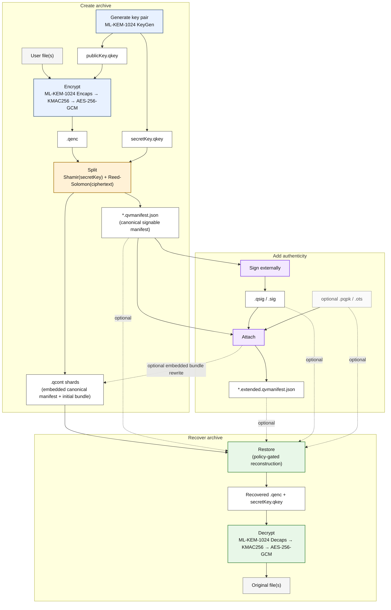

# Quantum Vault
## Encryption & Verification tool

Post-quantum archive encryption, threshold recovery, and detached authenticity for long-lived files.

Deep dive: see [`docs/WHITEPAPER.md`](docs/WHITEPAPER.md).
Documentation map: see [`docs/README.md`](docs/README.md).

This README is the product-facing overview: it complements the Whitepaper and is meant for onboarding, first impression, and understanding the workflow quickly. Byte-level formats, detailed policy semantics, and the long-term archival roadmap live under `docs/`.

* [What Quantum Vault Is For](#what-quantum-vault-is-for) | [Features](#features) | [Workflow](#workflow-at-a-glance) | [Authenticity](#authenticity-model) | [Security](#security-notes) | [Docs](#documentation-guide) | [Development](#development) | [License](#license)

## What Quantum Vault Is For

Quantum Vault is a browser-based tool for protecting long-lived files with post-quantum encryption, threshold recovery, and detached authenticity proofs.
A normal encrypted file solves confidentiality at one point in time, but long-lived archives often also need durable recovery, signer-verifiable provenance, mutable evidence that can be attached later, and an explicit rule for when restore is allowed. Quantum Vault is designed for archives that need to survive both post-quantum transition risk and ordinary operational failure.

| If you need to... | Quantum Vault does this by... |
| --- | --- |
| Keep archive contents confidential even if storage is copied | Encrypting locally in the browser with ML-KEM-1024, KMAC256, and AES-256-GCM |
| Avoid a single backup location becoming a single point of failure | Splitting one archive into threshold `.qcont` shards |
| Show that a specific signer key signed an archive description | Signing the canonical `*.qvmanifest.json` with detached `.qsig` or Stellar `.sig` proofs |
| Add signer keys or timestamp evidence later without invalidating signatures | Storing mutable authenticity artifacts in the manifest bundle, not in the canonical signed bytes |
| Block restore unless authenticity requirements are met | Evaluating archive policy during restore (`integrity-only`, `any-signature`, `strong-pq-signature`) |

### Current cryptographic profile

- ML-KEM-1024 for post-quantum key encapsulation
- KMAC256 for key derivation
- AES-256-GCM for payload encryption and AEAD integrity
- SHA3-512 for fixity and manifest binding
- Shamir Secret Sharing for private-key sharding
- Reed-Solomon erasure coding for ciphertext fragment recovery

## Features

- **Generate** a post-quantum ML-KEM key pair directly in the browser.
- **Encrypt** one or more files into a `.qenc` container for long-lived confidentiality.
- **Decrypt** Quantum Vault `.qenc` containers back into their original payload.
- **Split** an archive and its ML-KEM private key into threshold `.qcont` shards and export a canonical signable manifest.
- **Attach** detached signatures, signer identity material, and timestamp evidence into a self-contained manifest bundle.
- **Restore** from shards plus optional authenticity material, with recovery gated by archive policy.
- **Verify** detached signatures while keeping integrity, signer pinning, and policy satisfaction as separate outcomes.
- **Keep cryptographic operations local** to the client browser during normal operation.

## Workflow At A Glance

| Stage | Main inputs | Main outputs | What this stage adds |
| --- | --- | --- | --- |
| Generate | Browser entropy | `secretKey.qkey`, `publicKey.qkey` | ML-KEM key pair generated client-side |
| Encrypt | File(s), `publicKey.qkey` | `.qenc` | Post-quantum confidentiality and AEAD integrity |
| Split | `.qenc`, `secretKey.qkey` | `.qcont`, `*.qvmanifest.json` | Threshold recovery, embedded manifest, initial bundle |
| Attach | Manifest or bundle, `.qsig`/`.sig`, optional `.pqpk`, optional `.ots` | `*.extended.qvmanifest.json`, optional rewritten `.qcont` | Portable authenticity material without changing canonical signed bytes |
| Restore | `.qcont`, optional manifest/bundle, optional signatures, pins, timestamps | Recovered `.qenc`, recovered `secretKey.qkey` | Policy-gated archive reconstruction |
| Decrypt | `.qenc`, `secretKey.qkey` | Original file(s) | Payload recovery and file-hash confirmation |

## Workflow Overview


```mermaid
flowchart TB
    subgraph CREATE["Create archive"]
        G["Generate key pair<br/>ML-KEM-1024 KeyGen"]:::crypto
        PK["publicKey.qkey"]:::artifact
        SK["secretKey.qkey"]:::artifact
        U["User file(s)"]:::input
        E["Encrypt<br/>ML-KEM-1024 Encaps → KMAC256 → AES-256-GCM"]:::crypto
        Q[".qenc"]:::artifact
        S["Split<br/>Shamir(secretKey) + Reed-Solomon(ciphertext)"]:::split
        QC[".qcont shards<br/>(embedded canonical manifest + initial bundle)"]:::artifact
        CM["*.qvmanifest.json<br/>(canonical signable manifest)"]:::artifact

        G --> PK
        G --> SK
        U --> E
        PK --> E
        E --> Q
        Q --> S
        SK --> S
        S --> QC
        S --> CM
    end

    subgraph AUTH["Add authenticity"]
        SG["Sign externally"]:::auth
        SIG[".qsig / .sig"]:::artifact
        OPT["optional .pqpk / .ots"]:::optional
        AT["Attach"]:::auth
        EM["*.extended.qvmanifest.json"]:::artifact

        CM --> SG
        SG --> SIG
        CM --> AT
        SIG --> AT
        OPT --> AT
        AT --> EM
        AT -. optional embedded bundle rewrite .-> QC
    end

    subgraph RECOVER["Recover archive"]
        R["Restore<br/>(policy-gated reconstruction)"]:::restore
        OUT["Recovered .qenc + secretKey.qkey"]:::artifact
        D["Decrypt<br/>ML-KEM-1024 Decaps → KMAC256 → AES-256-GCM"]:::restore
        F["Original file(s)"]:::input

        QC --> R
        CM -. optional .-> R
        EM -. optional .-> R
        SIG -. optional .-> R
        OPT -. optional .-> R
        R --> OUT
        OUT --> D
        D --> F
    end

    classDef input fill:#f5f5f5,stroke:#666,stroke-width:1px,color:#111;
    classDef crypto fill:#e8f1ff,stroke:#3d5a80,stroke-width:1.5px,color:#111;
    classDef split fill:#fff1d6,stroke:#a06b00,stroke-width:1.5px,color:#111;
    classDef auth fill:#f3e8ff,stroke:#7c3aed,stroke-width:1.5px,color:#111;
    classDef restore fill:#e8f7e8,stroke:#2e7d32,stroke-width:1.5px,color:#111;
    classDef artifact fill:#ffffff,stroke:#444,stroke-width:1px,color:#111;
    classDef optional fill:#fafafa,stroke:#999,stroke-width:1px,color:#555;
```

## User Flow By Stage

| Stage | User action | Required inputs | Primary outputs | Important behavior |
| --- | --- | --- | --- | --- |
| 1. Generate | Create a key pair in-browser | None | `secretKey.qkey`, `publicKey.qkey` | Secrets stay client-side only |
| 2. Encrypt | Encrypt one file or a local file bundle | File(s), `publicKey.qkey` | `.qenc` | Uses ML-KEM-1024 + KMAC256 + AES-256-GCM |
| 3. Split | Convert one archive into threshold shards | `.qenc`, matching `secretKey.qkey` | `.qcont`, `*.qvmanifest.json` | Verifies the private key matches the archive before sharding |
| 4. Sign | Sign the canonical manifest in an external signer app | `*.qvmanifest.json` | `.qsig` or `.sig` | The signed bytes are always the canonical manifest, not the mutable bundle |
| 5. Attach | Merge signatures, pins, and timestamps into the bundle | Manifest or bundle, detached artifacts | `*.extended.qvmanifest.json`, optional rewritten shards | Full shard cohort rewrites embedded bundles; partial input updates only the manifest-side bundle |
| 6. Restore | Reconstruct from shards with optional authenticity inputs | `.qcont`, optional manifest/bundle/signatures/pins/timestamps | Recovered `.qenc`, recovered `secretKey.qkey` | Recovery is blocked unless the selected archive policy is satisfied |
| 7. Decrypt | Decrypt the recovered archive | `.qenc`, recovered `secretKey.qkey` | Original file(s) | The UI confirms `privateMeta.fileHash` before export |

## Artifact Overview

| Artifact | Produced by | Purpose | Notes |
| --- | --- | --- | --- |
| `publicKey.qkey` | Generate | ML-KEM public key | Used to encrypt |
| `secretKey.qkey` | Generate | Legacy filename for the ML-KEM private key | The object is an asymmetric `privateKey` |
| `.qenc` | Encrypt | Encrypted container | Carries public metadata, key commitment, ciphertext |
| `.qcont` | Split | Threshold shard | Carries one Shamir share, RS fragments, embedded manifest, embedded bundle |
| `*.qvmanifest.json` | Split | Canonical signable manifest | Immutable detached-signature payload |
| `*.extended.qvmanifest.json` | Attach | Self-contained manifest bundle | Mutable bundle containing policy, keys, signatures, timestamps |
| `.qsig` | Quantum Signer | Detached PQ signature | Signs canonical manifest bytes |
| `.sig` | Stellar WebSigner | Detached Ed25519 signature proof | Signs canonical manifest bytes |
| `.pqpk` | Quantum Signer | Detached PQ public key | Used for bundle pinning or user pinning |
| `.ots` | External timestamp tool | OpenTimestamps evidence | Linked to detached signature bytes, not to the bundle |

## Authenticity Model

Quantum Vault keeps four states separate:

1. integrity verified
2. signature verified
3. signer identity pinned
4. archive policy satisfied

Detached signatures from external signer apps ([Quantum Signer](https://github.com/CyberKiska/quantum-signer) `.qsig`, [Stellar WebSigner](https://github.com/CyberKiska/stellar-websigner) `.sig`) always target the canonical manifest bytes.
Timestamp evidence is supplementary and does not satisfy archive policy by itself.

| Policy level | Minimum requirement | Unsigned restore allowed | Ed25519-only signatures sufficient |
| --- | --- | --- | --- |
| `integrity-only` | No detached signature required | Yes | Yes, but not required |
| `any-signature` | `minValidSignatures` valid detached signatures | No | Yes |
| `strong-pq-signature` | `minValidSignatures` valid detached signatures and at least one valid strong PQ detached signature | No | No |

Current shipped defaults:

- Lite mode defaults to `integrity-only`.
- Pro mode defaults to `strong-pq-signature`.

Detailed current rules live in:

- [`docs/format-spec.md`](docs/format-spec.md) for container formats, manifest/bundle structure, canonicalization, verifier flow, and fail-closed behavior
- [`docs/trust-and-policy.md`](docs/trust-and-policy.md) for signature meaning, proof counting, pinning, archive policy, and restore authorization semantics

## Security Notes

- All cryptographic operations are intended to happen in the client browser; no private archive material should need to leave the user environment.
- JavaScript cryptography cannot provide strong side-channel guarantees against hostile local environments.
- ML-KEM gives confidentiality, not sender authentication; detached signatures and policy evaluation provide provenance at the archive layer.
- Shamir sharing protects confidentiality below threshold, but users still need independent and reliable shard custody.
- OpenTimestamps evidence is currently evidence-only and does not replace signature validation or policy satisfaction.
- Inspired by [diceslice](https://github.com/numago/diceslice) and [tidecoin](https://github.com/tidecoin/tidecoin).

### Sources and further reading

| Topic | Source |
| --- | --- |
| ML-KEM-1024 | [FIPS 203](https://doi.org/10.6028/NIST.FIPS.203) |
| ML-DSA | [FIPS 204](https://doi.org/10.6028/NIST.FIPS.204) |
| SLH-DSA | [FIPS 205](https://doi.org/10.6028/NIST.FIPS.205) |
| SHA-3 (`SHA3-256`, `SHA3-512`) | [FIPS 202](https://doi.org/10.6028/NIST.FIPS.202) |
| KMAC256 | [SP 800-185](https://doi.org/10.6028/NIST.SP.800-185) |
| AES-256-GCM | [SP 800-38D](https://doi.org/10.6028/NIST.SP.800-38D) |
| Ed25519 | [RFC 8032](https://www.rfc-editor.org/rfc/rfc8032) |
| Stellar address encoding | [SEP-0023](https://github.com/stellar/stellar-protocol/blob/master/ecosystem/sep-0023.md) |
| OpenTimestamps project | [opentimestamps.org](https://opentimestamps.org/) |

## Documentation Guide

| If you want to read about... | Go to |
| --- | --- |
| System rationale, design depth, and the higher-level architecture | [`docs/WHITEPAPER.md`](docs/WHITEPAPER.md) |
| Current artifact formats, canonicalization, verifier flow, and fail-closed behavior | [`docs/format-spec.md`](docs/format-spec.md) |
| Signature meaning, proof counting, pinning, and archive policy semantics | [`docs/trust-and-policy.md`](docs/trust-and-policy.md) |
| Threat model, assumptions, trust boundaries, and security invariants | [`docs/security-model.md`](docs/security-model.md) |
| Long-horizon archival direction, evidence renewal, and archive classes | [`docs/long-term-archive.md`](docs/long-term-archive.md) |
| Shared terminology and status vocabulary | [`docs/glossary.md`](docs/glossary.md) |
| Documentation roles, ownership, and source-of-truth map | [`docs/README.md`](docs/README.md) |

## Development

```bash
npm install
npm run dev
```

Additional commands:

```bash
npm run build
npm run selftest
```

### Deploy to GitHub Pages
CI runs on pull requests targeting `main` and merge-queue `merge_group` checks.
GitHub Pages deployment is handled by GitHub Actions (`.github/workflows/pages.yml`) on pushes to `main`.
The Pages workflow also supports manual dispatch, but the jobs are hard-blocked unless the selected ref is `main`.
For a local Pages-equivalent build, use:
```bash
BASE_PATH=/quantum-vault/ npm run build
```

Contributor orientation:

- `src/core/crypto/` contains the format, crypto, manifest, shard, and verification logic
- `src/core/features/` contains Lite/Pro workflow wiring and UI flows
- `src/app/` contains browser/runtime adapters and restore input helpers
- `scripts/` contains the dev server, build script, and headless self-test entrypoint

## License

This project is distributed under the terms of the GNU Affero General Public License v3.0. See the `LICENSE` file for the full text.

### Third‑party software licensed under other licenses

Browser encryption/decryption tool libraries:
* SHA3-512 for hashing and KMAC256 for KDF [noble-hashes](https://github.com/paulmillr/noble-hashes);
* ML-KEM-1024 for post-quantum key encapsulation used in combination with AES-256-GCM for symmetric file encryption [noble-post-quantum](https://github.com/paulmillr/noble-post-quantum);
* Shamir's secret sharing algorithm for splitting [shamir-secret-sharing](https://github.com/privy-io/shamir-secret-sharing);
* Reed-Solomon erasure codes for splitting based on [ErasureCodes](https://github.com/ianopolous/ErasureCodes/).

The application incorporates the following dependencies that are released under the permissive MIT License and Apache License 2.0.

| Library | Version | Copyright holder | Upstream repository |
| --- | --- | --- | --- |
| shamir-secret-sharing | 0.0.4 | Privy | https://github.com/privy-io/shamir-secret-sharing |
| noble-post-quantum | 0.5.4 | Paul Miller | https://github.com/paulmillr/noble-post-quantum |
| noble-hashes | 2.0.1 | Paul Miller | https://github.com/paulmillr/noble-hashes |
