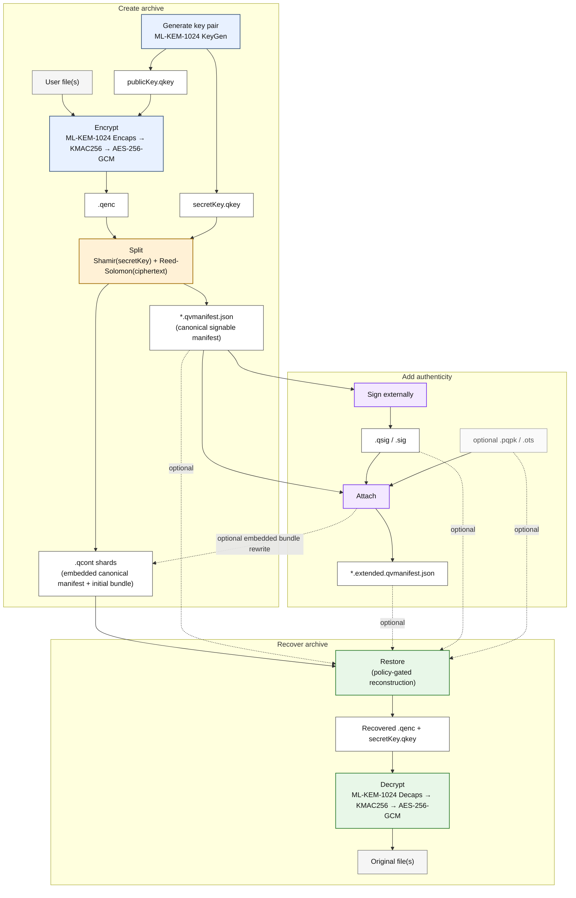

# Quantum Vault
## Encryption & Verification tool

* [Features](#features) | [Problematisation](#problematisation) | [Architecture](#architecture) | [Workflow](#workflow-overview) | [Honorable mention](#honorable-mention) | [Development](#development) | [License](#license)

------------

## Features
* **Generate** 3168‑byte secret key (`secretKey.qkey`) & 1568-byte public key (`publicKey.qkey`) for ML-KEM-1024 post-quantum key encapsulation algorithm.
* **Encrypt** client-side arbitrary files using hybrid cryptography. In this approach, the ML-KEM-1024 securely negotiates a symmetric key between the sides, which is then used by AES-256-GCM to directly encrypt the file data.
* **Decrypt** `.qenc` containers created by this tool.
* **Split** `.qenc` cryptocontainers with `.qkey` private keys into multiple `.qcont` shards, export canonical signable `*.qvmanifest.json`, and embed both the canonical manifest and an initial manifest bundle into every shard. You choose total shards n and RS data k; threshold t is computed as `t = k + (n-k)/2`. With fewer than t shards, no information about the original secret can be retrieved.
* **Attach** detached authenticity material (`.qsig`, Stellar `.sig`, `.pqpk`, `.ots`) to a canonical manifest or existing manifest bundle, producing a self-contained `*.extended.qvmanifest.json` bundle and optionally rewriting a full shard cohort in place.
* **Restore** from a single input set of files (`.qcont` + optional canonical `*.qvmanifest.json` or bundled `*.extended.qvmanifest.json` + optional `.qsig/.sig/.pqpk/.ots`) and reconstruct `.qenc` + private `.qkey` from a sufficient number of shards (>= t), but only if the archive authenticity policy is satisfied.
* **Verify** detached manifest signatures from external signer apps ([Quantum Signer](https://github.com/CyberKiska/quantum-signer) `.qsig`, [Stellar WebSigner](https://github.com/CyberKiska/stellar-websigner) `.sig`) with explicit archive policy evaluation, proof-identity deduplication, and separate bundle-pinned vs user-pinned signer identity reporting.
* **Verifies** file integrity using SHA3-512 hash sum and provides process logs to track operations.
* All cryptographic operations are performed directly in the client's browser, ensuring the confidentiality of user data.

### At a glance

| Stage | Main inputs | Main outputs | What this stage adds |
| --- | --- | --- | --- |
| Generate | Browser entropy | `secretKey.qkey`, `publicKey.qkey` | ML-KEM-1024 key pair |
| Encrypt | File(s), `publicKey.qkey` | `.qenc` | Post-quantum confidentiality and AEAD integrity |
| Split | `.qenc`, `secretKey.qkey` | `.qcont`, `*.qvmanifest.json` | Threshold recovery, embedded manifest, initial bundle |
| Attach | Manifest or bundle, `.qsig`/`.sig`, optional `.pqpk`, optional `.ots` | `*.extended.qvmanifest.json`, optional rewritten `.qcont` | Portable authenticity material without changing canonical signed bytes |
| Restore | `.qcont`, optional manifest/bundle, optional signatures/pins/timestamps | Recovered `.qenc`, recovered `secretKey.qkey` | Policy-gated archive reconstruction |
| Decrypt | `.qenc`, `secretKey.qkey` | Original file(s) | Payload recovery and UI-level file-hash confirmation |

### Archive artifacts

| Artifact | Produced by | Purpose | Notes |
| --- | --- | --- | --- |
| `.qenc` | Encrypt | Encrypted container | Carries public metadata, key commitment, ciphertext |
| `.qcont` | Split | Threshold shard | Carries one Shamir share, RS fragment stream, embedded manifest, embedded bundle |
| `*.qvmanifest.json` | Split | Canonical signable manifest | Immutable detached-signature payload |
| `*.extended.qvmanifest.json` | Attach | Self-contained manifest bundle | Mutable bundle containing policy, attached keys, signatures, timestamps |
| `.qsig` | Quantum Signer | Detached PQ signature | Current supported format is Quantum Signer v2 |
| `.sig` | Stellar WebSigner | Detached Ed25519 signature proof | Current supported format is `stellar-signature/v2` JSON |
| `.pqpk` | Quantum Signer | Detached PQ public key | Used for bundle pinning or user pinning |
| `.ots` | External timestamp tool | OpenTimestamps evidence | Linked to detached signature bytes, not to the bundle itself |

------------

## Problematisation

The risk of cryptographic obsolescence is a matter of concern. It is anticipated that classical asymmetric schemes (RSA, ECC) will become vulnerable once sufficiently large fault-tolerant quantum computers are developed. This process gives rise to two distinct risks associated with long-lived data:
* It can be argued that the present is an opportune moment to harvest encrypted data, as this may be decrypted in the future when PQ capabilities are extant.
* In the context of standards transition, it is anticipated that standards bodies will ultimately necessitate or advocate for the utilisation of post-quantum algorithms in novel systems and for archival data. Systems that do not employ PQC will encounter compatibility, compliance and migration expenses.

High-value data must be made available with a high degree of reliability and protection against single-point failures. Distributed threshold storage (Shamir shares across independent storage providers) has been shown to address availability and improve censorship resistance, but it has also been demonstrated to introduce metadata and integrity challenges.

It is imperative that users generate, back up, shard and restore cryptographic containers with minimal chance of loss or misconfiguration.

Threat model (concise):
* Adversary goals: confidentiality breach of stored files now or later; integrity forgeries; denial of recovery by withholding shares.
* Adversary capabilities: network observers, storage provider compromise, passive archive collection (future decryption), host compromise (user device), malicious browser extension, supply-chain compromise of third-party libs.
* Assumptions: attacker cannot simultaneously control threshold number of independent share custodians, user device may be compromised (lossy trust), users will use multiple independent storage locations for shares.

### Why Quantum Vault

Quantum Vault combines local post-quantum encryption, threshold recovery, and detached authenticity into one workflow. It is intended for situations where ordinary file encryption is not enough because you also want durable recovery, signer-verifiable provenance, and the ability to attach authenticity evidence later without changing the canonical signed archive description.

| If you need to... | Quantum Vault does this by... |
| --- | --- |
| Keep archive contents confidential even if storage is copied | Encrypting locally in the browser with ML-KEM-1024, KMAC256, and AES-256-GCM |
| Avoid a single backup location becoming a single point of failure | Splitting one archive into threshold `.qcont` shards |
| Prove who approved an archive | Signing the canonical `*.qvmanifest.json` with detached `.qsig` or Stellar `.sig` proofs |
| Add signer keys or timestamp evidence later without invalidating signatures | Storing mutable authenticity artifacts in the manifest bundle, not in the canonical signed bytes |
| Block restore unless authenticity requirements are met | Evaluating archive policy during restore (`integrity-only`, `any-signature`, `strong-pq-signature`) |

### High-level goals

1. Post-quantum confidentiality: Ensure that container data confidentiality resists known quantum attacks by using a lattice-based KEM (ML-KEM-1024) to agree symmetric keys and KMAC256 + AES-256-GCM hybrid encryption for payloads.
2. Durable distributed storage: Enable secure splitting and reconstruction that provide configurable threshold/availability guarantees without leaking information below threshold.
3. Zero-trust server model: All sensitive cryptographic operations and secrets must remain inside the user’s browser; no private material is uploaded or retained by any server.
4. Integrity and provenance: Provide robust content integrity checks (SHA3-512) and authenticated metadata so users can detect tampering and identify container format and parameter versions.
5. Usability & recoverability: Provide clear UX flows and automation for key generation, secure backups, shard distribution.
6. Align algorithms and parameters with authoritative recommendations & auditability.

------------

## Architecture

### Workflow overview


```mermaid
flowchart TB
    subgraph CREATE["Create archive"]
        G["Generate key pair<br/>ML-KEM-1024 KeyGen"]:::crypto
        PK["publicKey.qkey"]:::artifact
        SK["secretKey.qkey"]:::artifact
        U["User file(s)"]:::input
        E["Encrypt<br/>ML-KEM-1024 Encaps → KMAC256 → AES-256-GCM"]:::crypto
        Q[".qenc"]:::artifact
        S["Split<br/>Shamir(secretKey) + Reed-Solomon(ciphertext)"]:::split
        QC[".qcont shards<br/>(embedded canonical manifest + initial bundle)"]:::artifact
        CM["*.qvmanifest.json<br/>(canonical signable manifest)"]:::artifact

        G --> PK
        G --> SK
        U --> E
        PK --> E
        E --> Q
        Q --> S
        SK --> S
        S --> QC
        S --> CM
    end

    subgraph AUTH["Add authenticity"]
        SG["Sign externally"]:::auth
        SIG[".qsig / .sig"]:::artifact
        OPT["optional .pqpk / .ots"]:::optional
        AT["Attach"]:::auth
        EM["*.extended.qvmanifest.json"]:::artifact

        CM --> SG
        SG --> SIG
        CM --> AT
        SIG --> AT
        OPT --> AT
        AT --> EM
        AT -. optional embedded bundle rewrite .-> QC
    end

    subgraph RECOVER["Recover archive"]
        R["Restore<br/>(policy-gated reconstruction)"]:::restore
        OUT["Recovered .qenc + secretKey.qkey"]:::artifact
        D["Decrypt<br/>ML-KEM-1024 Decaps → KMAC256 → AES-256-GCM"]:::restore
        F["Original file(s)"]:::input

        QC --> R
        CM -. optional .-> R
        EM -. optional .-> R
        SIG -. optional .-> R
        OPT -. optional .-> R
        R --> OUT
        OUT --> D
        D --> F
    end

    classDef input fill:#f5f5f5,stroke:#666,stroke-width:1px,color:#111;
    classDef crypto fill:#e8f1ff,stroke:#3d5a80,stroke-width:1.5px,color:#111;
    classDef split fill:#fff1d6,stroke:#a06b00,stroke-width:1.5px,color:#111;
    classDef auth fill:#f3e8ff,stroke:#7c3aed,stroke-width:1.5px,color:#111;
    classDef restore fill:#e8f7e8,stroke:#2e7d32,stroke-width:1.5px,color:#111;
    classDef artifact fill:#ffffff,stroke:#444,stroke-width:1px,color:#111;
    classDef optional fill:#fafafa,stroke:#999,stroke-width:1px,color:#555;
```

### User flow by stage

| Stage | User action | Required inputs | Primary outputs | Important behavior |
| --- | --- | --- | --- | --- |
| 1. Generate | Create a key pair in-browser | None | `secretKey.qkey`, `publicKey.qkey` | Secrets stay client-side only |
| 2. Encrypt | Encrypt one file or a local file bundle | File(s), `publicKey.qkey` | `.qenc` | Uses ML-KEM-1024 + KMAC256 + AES-256-GCM |
| 3. Split | Convert one archive into threshold shards | `.qenc`, matching `secretKey.qkey` | `.qcont`, `*.qvmanifest.json` | Verifies the private key matches the archive before sharding |
| 4. Sign | Sign the canonical manifest in an external signer app | `*.qvmanifest.json` | `.qsig` or `.sig` | The signed bytes are always the canonical manifest, not the mutable bundle |
| 5. Attach | Merge signatures, pins, and timestamps into the bundle | Manifest or bundle, detached artifacts | `*.extended.qvmanifest.json`, optional rewritten shards | Full shard cohort rewrites embedded bundles; partial input updates only the manifest-side bundle |
| 6. Restore | Reconstruct from shards with optional authenticity inputs | `.qcont`, optional manifest/bundle/signatures/pins/timestamps | Recovered `.qenc`, recovered `secretKey.qkey` | Recovery is blocked unless the selected archive policy is satisfied |
| 7. Decrypt | Decrypt the recovered archive | `.qenc`, recovered `secretKey.qkey` | Original file(s) | The UI confirms `privateMeta.fileHash` before export |

### Mode defaults

| UI mode | Default archive policy | Intended path | Practical effect |
| --- | --- | --- | --- |
| Lite | `integrity-only` | Simpler protect/restore flow | Restore can proceed without detached signatures, but provenance is not signer-authenticated |
| Pro | `strong-pq-signature` | Full authenticity workflow | Restore blocks until at least one valid strong PQ detached signature satisfies policy |

### Project repository structure
```
LICENSE                              # License text (GPLv3)
README.md                            # Project overview, architecture, format docs
index.html                           # Main HTML file
style.css                            # Main CSS styles file
package.json                         # Dependencies and npm scripts
package-lock.json                    # Locked dependency graph
scripts/
├── dev.mjs                          # Local static dev server
├── build.mjs                        # Deterministic build + integrity checks
└── selftest.mjs                     # Headless self-test runner entrypoint
public/
└── third-party/
    └── erasure.js                   # Reed-Solomon runtime library
src/
├── main.js                          # Application entry point
├── utils.js                         # Shared browser utilities
├── app/                             # App-layer adapters (browser/runtime boundary)
│   ├── crypto-service.js            # UI-facing facade for core crypto operations
│   ├── session-wipe.js              # beforeunload/pagehide secret wipe registry
│   ├── browser-entropy-collector.js # Browser entropy collection (DOM events)
│   ├── restore-inputs.js            # Restore input classification from File objects
│   └── shard-preview.js             # Lightweight .qcont preview for UI status
└── core/
    ├── crypto/                      # Core crypto + format logic (UI-agnostic)
    │   ├── index.js                 # Main encryption/decryption orchestration
    │   ├── aead.js                  # AES-GCM nonce/IV policy helpers
    │   ├── kdf.js                   # KMAC derivation and key commitment helpers
    │   ├── kmac.js                  # Local SP 800-185 KMAC adapter over noble
    │   ├── mlkem.js                 # ML-KEM-1024 implementation
    │   ├── entropy.js               # CSPRNG + entropy mixing primitives
    │   ├── erasure-runtime.js       # RS runtime resolver (globalThis/injected)
    │   ├── constants.js             # Format/profile constants
    │   ├── policy.js                # Crypto policy validation
    │   ├── bytes.js                 # Byte/hex/constant-time helpers
    │   ├── qenc/
    │   │   └── format.js            # .qenc header build/parse
    │   ├── qcont/
    │   │   ├── build.js             # Shard construction + initial manifest bundle
    │   │   ├── attach.js            # Manifest bundle attach/merge workflow
    │   │   └── restore.js           # Shard restore/reconstruction + authenticity gating
    │   ├── manifest/
    │   │   ├── archive-manifest.js  # Canonical archive manifest schema/validation
    │   │   ├── manifest-bundle.js   # Self-contained manifest bundle schema/validation
    │   │   └── jcs.js               # Project-defined canonicalization helpers (QV-C14N-v1)
    │   ├── auth/
    │   │   ├── qsig.js              # Quantum Signer v2 detached signature parsing/verify
    │   │   ├── stellar-sig.js       # Stellar WebSigner v2 detached signature verify
    │   │   ├── opentimestamps.js    # OpenTimestamps parsing/linking
    │   │   ├── signature-identity.js # Detached proof identity normalization/dedupe
    │   │   ├── signature-suites.js  # Normalized signature suite registry
    │   │   └── verify-signatures.js # Unified verification policy orchestration
    │   ├── splitting/
    │   │   └── sss.js               # Shamir Secret Sharing
    │   └── selftest.js              # Headless/browser self-test suite
    └── features/                    # UI workflows and rendering
        ├── lite-mode.js             # Simplified interface
        ├── bundle-payload.js        # Multi-file bundle payload helpers
        ├── qcont/
        │   ├── build-ui.js          # Pro split UI handlers
        │   ├── attach-ui.js         # Pro attach UI handlers
        │   └── restore-ui.js        # Pro restore UI handlers
        └── ui/
            ├── ui.js                # Pro UI orchestration
            ├── shards-status.js     # Shard threshold/readiness status UI
            ├── logging.js           # Unified structured logs for Lite/Pro
            └── toast.js             # Toast notification UI helpers
dist/                                # Generated build artifacts
```

### Module map

| Area | Responsibility | Key outputs or decisions |
| --- | --- | --- |
| `src/core/crypto/index.js` | Encrypt/decrypt orchestration | `.qenc` construction and parsing |
| `src/core/crypto/qenc/` | Archive header format | Container header and metadata framing |
| `src/core/crypto/qcont/build.js` | Split/shard builder | `.qcont`, canonical manifest, initial bundle |
| `src/core/crypto/qcont/attach.js` | Bundle attachment workflow | Extended bundle, optional shard rewrites |
| `src/core/crypto/qcont/restore.js` | Cohort selection and reconstruction | Policy-gated restore, mixed-bundle handling |
| `src/core/crypto/manifest/` | Manifest and bundle schemas | Canonical archive description and mutable authenticity bundle |
| `src/core/crypto/auth/` | Detached signature and OTS verification | PQ signatures, Stellar proofs, proof-identity dedupe, timestamp linkage |
| `src/app/restore-inputs.js` | Restore-time file classification | Detects `.qcont`, manifest, bundle, signatures, `.pqpk`, `.ots` |
| `src/core/features/qcont/` | Pro mode workflows | Build, Attach, Restore UI integration |
| `src/core/features/lite-mode.js` | Lite mode workflow | Simpler end-to-end protect/restore experience |

### Components
* Post-quantum Module-Lattice-based Key Encapsulation Mechanism: **ML-KEM-1024**. Used to encapsulate/decapsulate a shared secret.
* Key derivation function: **KMAC256**. Used to derive the AES encryption key and AES IV's from the shared secret.
* Authenticated Encryption with Associated Data: **AES-256-GCM**. Used to encrypt the file payload and authenticate the header additional authenticated data (AAD).
* Secret sharing algorithm: **Shamir's secret sharing**. Used to shard and reconstruct private keys files.
* File sharing algorithm: **Reed-Solomon codes**. Used to shard and reconstruct containers files.

### Container format (binary)
* `.qenc` file format (one file is encrypted container - single-stream or per-chunk AEAD)

| Data | Length | Description |
| --- | --- | --- |
| MAGIC | 4 bytes | ASCII `QVv1` |
| keyLen | 4 bytes (Uint32 BE) | length of `encapsulatedKey` |
| encapsulatedKey | keyLen bytes | ML‑KEM ciphertext |
| containerNonce | 12 bytes | container nonce / IV root |
| kdfSalt | 16 bytes | random salt for KMAC |
| metaLen | 2 bytes (Uint16 BE) | length of `metaJSON` |
| metaJSON | metaLen bytes UTF‑8 | JSON metadata |
| keyCommitment | 32 bytes | required SHA3‑256(Kenc) key commitment |
| ciphertext | remaining bytes | AES‑GCM ciphertext (single or concatenation) |

`.qenc` metaJSON (indicative):
```json
{
  "KEM":"ML-KEM-1024",
  "KDF":"KMAC256",
  "AEAD":"AES-256-GCM",
  "fmt":"QVv1-5-0",
  "cryptoProfileId":"QV-MLKEM1024-KMAC256-AES256GCM-SHA3_512-v2",
  "kdfTreeId":"QV-KDF-TREE-v2",
  "aead_mode":"single-container-aead | per-chunk-aead",
  "iv_strategy":"single-iv | kmac-prefix64-ctr32-v3",
  "noncePolicyId":"QV-GCM-RAND96-v1 | QV-GCM-KMACPFX64-CTR32-v3",
  "nonceMode":"random96 | kmac-prefix64-ctr32",
  "counterBits":0 | 32,
  "maxChunkCount":1 | 4294967295,
  "aadPolicyId":"QV-AAD-HEADER-CHUNK-v1",
  "hasKeyCommitment": true,
  "payloadFormat":"wrapped-v1",
  "payloadLength": 12345,
  "chunkSize": 8388608,
  "chunkCount": 1,
  "domainStrings": {
    "kdf":"quantum-vault:kdf:v2",
    "iv":"quantum-vault:chunk-iv:v2",
    "kenc":"quantum-vault:kenc:v2",
    "kiv":"quantum-vault:kiv:v2"
  }
}
```

Private metadata (encrypted inside payload, `wrapped-v1`):
```json
{
  "originalFilename":"<string|null>",
  "timestamp":"<ISO8601 time>",
  "fileHash":"<SHA3-512 hex of original file>",
  "originalLength": 123
}
```

Payload format (`wrapped-v1`):
```
[uint32be privateMetaLen][privateMetaJSON][fileBytes]
```

*Note: when `aead_mode` is `per-chunk-aead`, the ciphertext is a concatenation of per‑chunk AES‑GCM outputs (each chunk includes its 16‑byte tag).*

AAD:
* Single-container AEAD: entire header from MAGIC through `metaJSON`.
* Per-chunk AEAD: `AAD_i = header || uint32_be(chunkIndex) || uint32_be(plainLen_i)`.

* `.qcont` composite shard file format (one file contains part of Shamir's splited key + part of RS fragment)

| Data | Length | Description |
| --- | --- | --- |
| MAGIC_SHARD | 4 bytes | ASCII `QVC1` |
| metaLen | 2 bytes (Uint16 BE) | |
| metaJSON | metaLen bytes (UTF-8) | RS params, counts, hashes, etc. |
| manifestLen | 4 bytes (Uint32 BE) | length of embedded canonical archive manifest |
| manifestBytes | manifestLen bytes | full canonical signable `*.qvmanifest.json` bytes |
| manifestDigest | 64 bytes | SHA3-512(manifestBytes) |
| bundleLen | 4 bytes (Uint32 BE) | length of embedded manifest bundle |
| bundleBytes | bundleLen bytes | full canonical `QV-Manifest-Bundle` JSON bytes |
| bundleDigest | 64 bytes | SHA3-512(bundleBytes) |
| encapBlobLen | 4 bytes (Uint32 BE) | |
| encapBlob | encapBlobLen bytes | ML-KEM ciphertext |
| containerNonce | 12 bytes | from `.qenc` header |
| kdfSalt | 16 bytes | from `.qenc` header |
| qencMetaLen | 2 bytes (Uint16 BE) | |
| qencMetaBytes | qencMetaLen bytes (UTF-8) | original `.qenc` metadata (dup for convenience) |
| keyCommitLen | 1 byte | key commitment length (must be 32 in current format) |
| keyCommitBytes | keyCommitLen bytes | required SHA3-256(Kenc) from `.qenc` header |
| shardIndex | 2 bytes (Uint16 BE) | 0-based index (0..n-1) |
| shareLen | 2 bytes (Uint16 BE) | |
| shareBytes | shareLen bytes | one Shamir share |
| fragments stream | … | concatenation of per-chunk fragments for this shard; |
| | | each fragment is stored as `[len32 | fragmentBytes]` |

`.qcont` metaJSON (indicative):
```json
{
  "containerId":"<SHA3-512 hex of .qenc header>",
  "alg":{"KEM":"ML-KEM-1024","KDF":"KMAC256","AEAD":"AES-256-GCM","RS":"ErasureCodes","fmt":"QVqcont-6"},
  "aead_mode":"single-container | per-chunk",
  "iv_strategy":"single-iv | kmac-prefix64-ctr32-v3",
  "cryptoProfileId":"QV-MLKEM1024-KMAC256-AES256GCM-SHA3_512-v2",
  "kdfTreeId":"QV-KDF-TREE-v2",
  "noncePolicyId":"QV-GCM-RAND96-v1 | QV-GCM-KMACPFX64-CTR32-v3",
  "nonceMode":"random96 | kmac-prefix64-ctr32",
  "counterBits":0 | 32,
  "maxChunkCount":1 | 4294967295,
  "aadPolicyId":"QV-AAD-HEADER-CHUNK-v1",
  "n":5,"k":3,"m":2,"t":4,
  "rsEncodeBase":255,
  "chunkSize":8388608,
  "chunkCount":1,
  "containerHash":"<SHA3-512 hex of .qenc file>",
  "encapBlobHash":"<SHA3-512 hex>",
  "privateKeyHash":"<SHA3-512 hex>",
  "payloadLength":12345,
  "originalLength":123,
  "ciphertextLength":456,
  "domainStrings":{
    "kdf":"quantum-vault:kdf:v2",
    "iv":"quantum-vault:chunk-iv:v2",
    "kenc":"quantum-vault:kenc:v2",
    "kiv":"quantum-vault:kiv:v2"
  },
  "fragmentFormat":"len32-prefixed",
  "perFragmentSize":789,
  "hasKeyCommitment":true,
  "keyCommitmentHex":"<hex>",
  "hasEmbeddedManifest":true,
  "manifestDigest":"<SHA3-512(manifestBytes)>",
  "hasEmbeddedBundle":true,
  "bundleDigest":"<SHA3-512(bundleBytes)>",
  "authPolicyLevel":"integrity-only | any-signature | strong-pq-signature",
  "shareCommitments":["<hex>", "..."],
  "fragmentBodyHashes":["<hex>", "..."],
  "timestamp":"<ISO8601 time>"
}
```

*Note: for `wrapped-v1`, `payloadLength` refers to the encrypted payload size (private metadata + file bytes). The original file length is stored inside the private metadata.*

### Canonical archive manifest (`*.qvmanifest.json`)
Canonical manifest is generated at split stage with schema/version `quantum-vault-archive-manifest/v2` and serialized as project-defined canonical JSON `QV-C14N-v1` (not full RFC 8785). The same canonical bytes are:
* exported as the signable `*.qvmanifest.json`,
* embedded into every `.qcont` shard,
* embedded inside every manifest bundle,
* used as detached-signature input for `.qsig/.sig`.

Key contract points:
* Primary authenticity anchor is `qenc.qencHash` with explicit algorithm `qenc.hashAlg = "SHA3-512"` (hash over full `.qenc` bytes).
* `qenc.containerId` is a secondary identifier (`containerIdRole = "secondary-header-id"`, `containerIdAlg = "SHA3-512(qenc-header-bytes)"`).
* Nonce policy is mode-bound and explicit: `noncePolicyId`, `nonceMode`, `counterBits`, `maxChunkCount`.
* Per-chunk nonce contract is fail-closed: `chunkIndex` is uint32, `0 <= chunkIndex < chunkCount <= maxChunkCount <= 4294967295`.
* `shardBinding` is explicitly defined and non-recursive:
  * `bodyDefinitionId = "QV-QCONT-SHARDBODY-v1"`
  * shard body hash input includes fragment stream payload only (`len32-prefixed` RS fragment stream),
  * excludes header, embedded manifest/digest, embedded bundle/digest, and external signatures,
  * optional Shamir share commitments commit to raw share bytes.
* archive authenticity policy is committed inside the canonical manifest as `authPolicyCommitment`; the concrete `authPolicy` object lives in the manifest bundle.

Current supported format boundary is fail-closed:
* archive manifests must use `quantum-vault-archive-manifest/v2`,
* `.qcont` shards must use `QVqcont-6`,
* detached PQ signatures must use Quantum Signer major version 2 with context `quantum-signer/v2`,
* Stellar detached signatures must use `stellar-signature/v2`.

### Manifest bundle (`*.extended.qvmanifest.json`)
Manifest bundle is a self-contained mutable JSON object with:
* embedded canonical `manifest`,
* `manifestDigest = SHA3-512(canonical manifest bytes)`,
* explicit `authPolicy` (`integrity-only | any-signature | strong-pq-signature` plus `minValidSignatures`),
* attached `publicKeys[]`, `signatures[]`, and `timestamps[]`.

Changing bundle attachments does not mutate the canonical manifest bytes and does not change detached-signature payload semantics.

Typical naming:
* split exports canonical signable manifest as `*.qvmanifest.json`,
* attach exports self-contained bundle as `*.extended.qvmanifest.json`,
* exporting a signable manifest from an existing bundle uses `*.signable.qvmanifest.json`.

### Detached signatures, pinning and timestamps
Supported detached signature formats:
* Quantum Signer `.qsig` (current supported detached format: major version 2, context `quantum-signer/v2`)
* Stellar WebSigner `.sig` JSON documents with schema `stellar-signature/v2`, proof type `sep53-message-signature` or `xdr-envelope-proof`

Detached-signature verification occurs during Attach (when importing external artifacts into a bundle) and during Restore (when evaluating archive authenticity policy).

### Signature and evidence comparison

| Artifact | Produced by | What it authenticates | Post-quantum | Can satisfy archive policy | Typical pin source |
| --- | --- | --- | --- | --- | --- |
| `.qsig` | Quantum Signer | Canonical manifest bytes | Yes | Yes | Bundled `.pqpk` or user-supplied `.pqpk` |
| `.sig` | Stellar WebSigner | Canonical manifest bytes | No, Ed25519 only | Yes for `any-signature`; never enough for `strong-pq-signature` by itself | Bundled Stellar signer address or expected signer input |
| `.ots` | OpenTimestamps tooling | Detached signature bytes (linked by stamped SHA-256) | N/A | No | None; evidence only |

Supported signer pin sources:
* `bundlePinned`: signer identity comes from material embedded in the manifest bundle (for example attached `.pqpk` or bundled Stellar signer address),
* `userPinned`: signer identity comes from restore-time user input (`.pqpk` or expected Stellar signer),
* `signerPinned = bundlePinned || userPinned`.

Archive policy satisfaction does not by itself require a signer pin. Pinning binds a verified detached signature to an expected signer identity when the bundle or the user supplies that identity.

### Archive policy levels

| Policy level | Minimum requirement | Unsigned archive restorable | Ed25519-only signatures sufficient |
| --- | --- | --- | --- |
| `integrity-only` | No detached signature required | Yes | Yes, but not required |
| `any-signature` | `minValidSignatures` valid detached signatures | No | Yes |
| `strong-pq-signature` | `minValidSignatures` valid detached signatures and at least one valid strong PQ detached signature | No | No |

### Authenticity status fields

| Field | Meaning |
| --- | --- |
| `signatureVerified` | At least one detached signature verified successfully |
| `strongPqSignatureVerified` | At least one verified detached signature came from a strong PQ suite |
| `bundlePinned` | At least one verified signature matched signer material embedded in the bundle |
| `userPinned` | At least one verified signature matched signer material supplied by the user at restore time |
| `policySatisfied` | The selected archive authenticity policy accepted the available valid signatures |

Policy counting rules:
* `minValidSignatures` counts unique detached proof identities, not repeated verification results of the same proof,
* semantically equivalent Stellar v2 proofs are deduplicated even if the JSON is serialized differently,
* `strong-pq-signature` requires at least one valid strong PQ detached signature,
* invalid extra signatures are reported but ignored for policy counting.

OpenTimestamps rules:
* timestamps are attached to detached signature bytes, not to the manifest bundle itself,
* OTS may be embedded inside the bundle or supplied externally as `.ots`,
* restore links OTS by stamped `SHA-256(detachedSignatureBytes)`,
* if multiple OTS proofs target the same detached signature, restore reports one preferred evidence item and prefers apparently complete proofs,
* unrelated or ambiguous `.ots` files fail closed,
* current OTS handling parses and links stamped digests and reports whether a proof appears complete; it does not independently validate a full external timestamp attestation chain,
* OTS evidence never satisfies archive signature policy by itself.

### Encapsulation & KDF
1. Receiver generates ML‑KEM‑1024 key pair (public `publicKey.qkey` 1568 B, private `secretKey.qkey` 3168 B).
2. Sender: `{encapsulatedKey, sharedSecret} = ml_kem1024.encapsulate(publicKey)`.
3. Generate `kdfSalt` (16 B) and `containerNonce` (12 B).
4. Derive keys with KMAC256:
   - `Kraw = KMAC256(sharedSecret, (kdfSalt || metaBytes), { dkLen: 32, customization: domainStrings.kdf })`
   - `Kenc = KMAC256(Kraw, [1], { dkLen: 32, customization: domainStrings.kenc })`
   - `Kiv  = KMAC256(Kraw, [2], { dkLen: 32, customization: domainStrings.kiv })`
   - Import `Kenc` as AES‑GCM key. For per-chunk mode:
     - `prefix64 = KMAC256(Kiv, containerNonce, { dkLen: 8, customization: domainStrings.iv })`
     - `IV_i = prefix64 || uint32_be(chunkIndex)` (`iv_strategy = kmac-prefix64-ctr32-v3`).
   - Key commitment: `keyCommitment = SHA3-256(Kenc)` (required in current supported containers and shards).

### Encrypt flow (sender)
* Single-container AEAD (small files):
1. Build payload as `wrapped-v1` (private metadata + file bytes).
2. Generate containerNonce (12B) random; call ciphertext = AES-GCM.encrypt(payload, iv=containerNonce, key=aesKey, AAD=headerBytes).
3. Produce `.qenc` with header (including key commitment) + ciphertext.
* Per-chunk AEAD (big files):
1. Build payload as `wrapped-v1`.
2. Break payload into chunks of `chunkSize`. For each chunk index i compute `IV_i = prefix64 || uint32_be(i)` with `prefix64 = KMAC256(Kiv, containerNonce, { dkLen: 8, customization: domainStrings.iv })`.
3. Encrypt each chunk with AES‑GCM using `AAD_i = header || uint32_be(i) || uint32_be(plainLen_i)`.
4. Concatenate all `cipherChunk_i` to form the ciphertext stream in `.qenc`.

### Decrypt flow (recipient)
1. Read container bytes and ensure length >= minimal header size.
2. Parse header fields (MAGIC, keyLen, encapsulatedKey, iv, salt, metaLen, metaJson). Validate `metaLen` and `keyLen` bounds.
3. Validate strict policy metadata (`cryptoProfileId`, domain strings, nonce policy/mode/bounds, AEAD mode).
4. `sharedSecret = ml_kem1024.decapsulate(encapsulatedKey, secretKey)`; normalize to `Uint8Array`.
5. Derive AES key with `KMAC256(sharedSecret, salt || metaBytes, { dkLen: 32, customization: domainStrings.kdf })`, then derive `Kenc`/`Kiv` with their dedicated domain strings. Import key. Zeroize derived bytes and `sharedSecret`.
6. Verify the required `keyCommitment` before decryption.
7. Decrypt with AES-GCM providing `additionalData = header`. If auth fails, raise an error (tampered container or wrong key).
8. If `payloadFormat` is `wrapped-v1`, unpack private metadata and recover original file bytes.
9. If end-to-end payload integrity confirmation is needed, compute `SHA3-512(fileBytes)` and compare it to `privateMeta.fileHash` after decryption. The current restore UI performs this check before exporting restored files.

### Sharding (split / combine)
* Split (.qenc → .qcont): parse the `.qenc` header, Shamir‑split the ML‑KEM private key into `n` shares with threshold `t = k + (n-k)/2`, Reed‑Solomon split the ciphertext into `n` fragments tolerating up to `(n-k)/2` erasures, and embed both the canonical archive manifest and the initial manifest bundle into every `.qcont` shard.
* Attach (manifest/bundle + detached artifacts): verify external `.qsig/.sig`, optionally bind exact signer identity with `.pqpk` or expected Stellar signer, attach `.ots`, and emit a self-contained manifest bundle. If a full shard cohort is loaded, the embedded bundle inside every shard can be rewritten in place without mutating canonical manifest bytes; otherwise Attach updates only the manifest-side bundle.
* Combine (.qcont → .qenc + .qkey): parse all provided files, classify optional external manifest/bundle/signature/timestamp inputs, resolve archive context deterministically from the uploaded bundle, the uploaded canonical manifest, or embedded bundle preference logic (no “largest cohort wins”), verify commitments/hashes, evaluate signature policy, reconstruct private key via Shamir, reconstruct ciphertext via RS, rebuild `.qenc`, and verify `qencHash` from the canonical manifest before decrypt path is allowed. If multiple bundle cohorts share the same canonical manifest, a canonical manifest alone may be insufficient to disambiguate restore; provide the bundle file or signer pins in that case.

------------

## Honorable mention

### Security notes

* Lattice-based key encapsulation mechanism, defined in [FIPS-203](https://nvlpubs.nist.gov/nistpubs/FIPS/NIST.FIPS.203.pdf). This algorithm, like other post-quantum algorithms, is designed to be resistant to attacks by quantum computers that could potentially break modern cryptosystems based on factorisation of large numbers or discrete logarithm, such as RSA and ECC. The ML-KEM-1024 provides Category 5 security level (roughly equivalent to AES-256) according to NIST guidelines.
* KMAC is a NIST-approved ([SP 800-185](https://csrc.nist.gov/pubs/sp/800/185/final)) keyed algorithm based on KECCAK for MAC/PRF/KDF tasks. KMAC is considered a direct replacement for HMAC for the SHA-3 family.
* Using audited libraries for hashing and secret-sharing: `noble-hashes` was independently audited by Cure53, and `shamir-secret-sharing` was audited by Cure53 and Zellic. The `noble-post-quantum` library has not been independently audited at this time.
* Using SHA3-512 for hash sums is in line with post-quantum security recommendations, as quantum computers can reduce hash cracking time from 2^n to 2^n/2 operations. Australian ASD prohibits SHA256 and similar hashes after 2030.
* There is no protection in JavaScript implementations of cryptographic algorithms against side-channel attacks. This is due to the way JIT compilers and rubbish collectors work in JavaScript environments, which makes achieving true runtime constancy extremely difficult. If an attacker can access application memory, they can potentially extract sensitive information.
* ML-KEM (Key Encapsulation Mechanism) does not check who sent the ciphertext. If you decrypt it with the wrong public key, it will simply return a different shared secret, not an error.
* Shamir's algorithm (SSS) provides information-theoretic security, which means that if there are less than a threshold number of shares, no information about the original secret can be obtained, regardless of computational power. Users need to independently ensure the reliability of storing each share.
* Inspired by [diceslice](https://github.com/numago/diceslice) and [tidecoin](https://github.com/tidecoin/tidecoin).

### Sources and further reading

| Topic | Source |
| --- | --- |
| ML-KEM-1024 | [FIPS 203](https://doi.org/10.6028/NIST.FIPS.203) |
| ML-DSA | [FIPS 204](https://doi.org/10.6028/NIST.FIPS.204) |
| SLH-DSA | [FIPS 205](https://doi.org/10.6028/NIST.FIPS.205) |
| SHA-3 (`SHA3-256`, `SHA3-512`) | [FIPS 202](https://doi.org/10.6028/NIST.FIPS.202) |
| KMAC256 | [SP 800-185](https://doi.org/10.6028/NIST.SP.800-185) |
| AES-256-GCM | [SP 800-38D](https://doi.org/10.6028/NIST.SP.800-38D) |
| Ed25519 | [RFC 8032](https://www.rfc-editor.org/rfc/rfc8032) |
| Stellar address encoding | [SEP-0023](https://github.com/stellar/stellar-protocol/blob/master/ecosystem/sep-0023.md) |
| OpenTimestamps project | [opentimestamps.org](https://opentimestamps.org/) |

------------

## Development
### Installation 
```bash
npm install
npm run dev
```

### Production Build
```bash
npm run build
```

### Self-test
```bash
npm run selftest
```

### Deploy to GitHub Pages
Deployment is handled by GitHub Actions (`.github/workflows/pages.yml`) on every push to `main`.
For a local Pages-equivalent build, use:
```bash
BASE_PATH=/quantum-vault/ npm run build
```

------------

## License

This project is distributed under the terms of the GNU Affero General Public License v3.0. See the `LICENSE` file for the full text.

### Third‑party software licensed under other licenses

Browser encryption/decryption tool libraries:
* SHA3-512 for hashing and KMAC256 for KDF [noble-hashes](https://github.com/paulmillr/noble-hashes);
* ML-KEM-1024 for post-quantum key encapsulation used in combination with AES-256-GCM for symmetric file encryption [noble-post-quantum](https://github.com/paulmillr/noble-post-quantum);
* Shamir's secret sharing algorithm for splitting [shamir-secret-sharing](https://github.com/privy-io/shamir-secret-sharing);
* Reed-Solomon erasure codes for splitting based on [ErasureCodes](https://github.com/ianopolous/ErasureCodes/).

The application incorporates the following dependencies that are released under the permissive MIT License and Apache License 2.0.

| Library | Version | Copyright holder | Upstream repository |
| --- | --- | --- | --- |
| shamir-secret-sharing | 0.0.4 | Privy | https://github.com/privy-io/shamir-secret-sharing |
| noble-post-quantum | 0.5.4 | Paul Miller | https://github.com/paulmillr/noble-post-quantum |
| noble-hashes | 2.0.1 | Paul Miller | https://github.com/paulmillr/noble-hashes |
