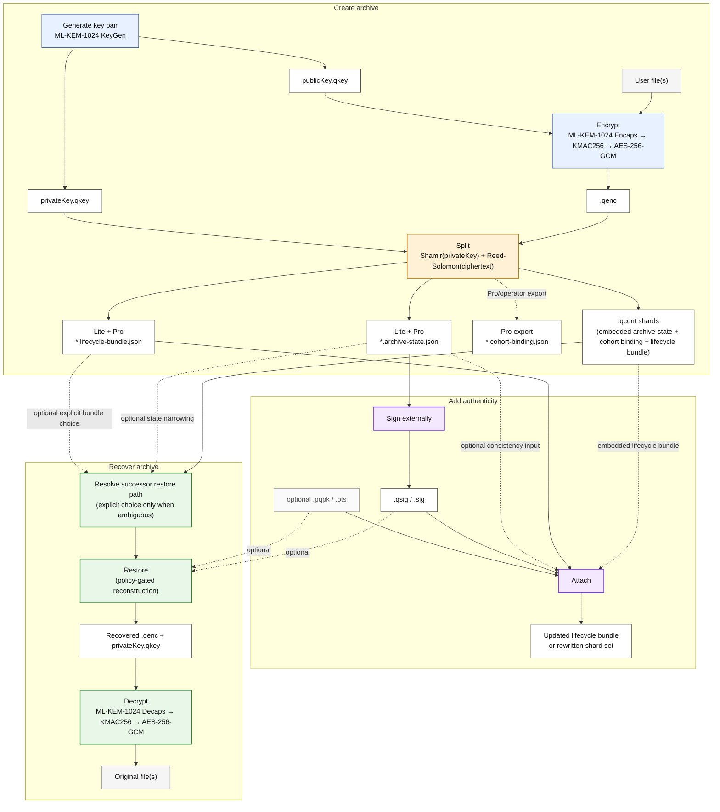

# Quantum Vault
## Encryption & Verification tool

Post-quantum archive encryption, threshold recovery, and detached authenticity for long-lived files.

Deep dive: see [`docs/WHITEPAPER.md`](docs/WHITEPAPER.md).  
Documentation map: see [`docs/README.md`](docs/README.md).

This README is the product-facing overview: it complements the whitepaper and is meant for onboarding, first impression, and understanding the workflow quickly. Byte-level formats, detailed policy semantics, and the long-term archival roadmap live under `docs/`.

Quantum Vault currently ships one successor lifecycle family:

- `QVqcont-7` shards
- archive-state descriptors
- cohort bindings
- `QV-Lifecycle-Bundle` v1

Archive approval is over canonical archive-state descriptor bytes. Lifecycle bundles stay mutable so detached signatures, signer material, timestamp proofs, transition records, and source-evidence objects can accumulate over time without invalidating the signed archive-state bytes.

* [What Quantum Vault Is For](#what-quantum-vault-is-for) | [Features](#features) | [Workflow](#workflow-at-a-glance) | [Authenticity](#authenticity-model) | [Security](#security-notes) | [Docs](#documentation-guide) | [Development](#development) | [License](#license)

## What Quantum Vault Is For

Quantum Vault is a browser-based tool for protecting long-lived files with post-quantum encryption, threshold recovery, and detached authenticity proofs.
A normal encrypted file solves confidentiality at one point in time, but long-lived archives often also need durable recovery, signer-verifiable provenance, mutable evidence that can be attached later, and an explicit rule for when restore is allowed.
Quantum Vault is designed for archives that need to survive both post-quantum transition risk and ordinary operational failure.

Long-lived archives also force three questions that should not be collapsed into one verdict. Confidentiality asks whether captured ciphertext can still resist later decryption; NIST IR 8547 treats this harvest-now-decrypt-later risk as the urgent migration driver for key-establishment schemes. Authenticity asks whether a signer key approved a specific archive state; that is why Quantum Vault keeps detached signatures and signer pinning separate from AEAD integrity. Time evidence asks whether a signed artifact can be shown to have existed before a claimed time boundary; the current implementation can link OpenTimestamps proofs to detached signature bytes, but RFC 4998-style renewable evidence remains future work.

| If you need to... | Quantum Vault does this by... |
| --- | --- |
| Keep archive contents confidential even if storage is copied | Encrypting locally in the browser with ML-KEM-1024, KMAC256, and AES-256-GCM |
| Avoid a single backup location becoming a single point of failure | Splitting one archive into threshold `QVqcont-7` shards |
| Show that a specific signer key approved one archive state | Verifying detached `.qsig` or Stellar `.sig` proofs over the canonical archive-state descriptor |
| Add signer keys or timestamp evidence later without invalidating archive approval | Storing mutable authenticity artifacts in `QV-Lifecycle-Bundle` v1 instead of in the signed archive-state bytes |
| Block restore unless authenticity requirements are met | Evaluating archive policy during restore (`integrity-only`, `any-signature`, `strong-pq-signature`) |

### Current implementation surface

Implemented now:

- one shipped successor lifecycle family: `QVqcont-7` shards, `quantum-vault-archive-state-descriptor/v1`, cohort bindings, and `QV-Lifecycle-Bundle` v1
- Split emits successor `.qcont` shards plus `*.archive-state.json` and `*.lifecycle-bundle.json`; Pro additionally exports `*.cohort-binding.json`, although successor shards always embed cohort-binding bytes even when Lite does not export a standalone cohort-binding file.
- Attach accepts successor shards or an existing lifecycle bundle plus optional archive-state descriptors, detached signatures, `.pqpk` signer pins, and `.ots` proofs.
- Restore evaluates archive approval from canonical archive-state bytes and fails closed when ambiguity remains in `archiveId`, `stateId`, `cohortId`, or embedded lifecycle-bundle digest unless the operator makes an explicit choice; explicit operator selection is a warned override, not an automatic winner selection.
- Same-state resharing is implemented for successor lifecycle archives and preserves archive-state bytes while emitting a new cohort and required transition record.

Deferred roadmap:

- RFC 4998-style renewable evidence
- state-changing continuity records across future rewrap or reencryption
- governance or trust-root objects

### Current cryptographic profile

- ML-KEM-1024 (FIPS 203) for post-quantum key encapsulation
- KMAC256 (SP 800-185) for key derivation
- AES-256-GCM (SP 800-38D) for payload encryption and AEAD integrity
- SHA3-512 (FIPS 202) for fixity, binding, and lifecycle digests
- Shamir Secret Sharing for private-key sharding
- Reed-Solomon erasure coding for ciphertext fragment recovery

## Features

- **Generate** a post-quantum ML-KEM key pair directly in the browser.
- **Encrypt** one or more files into a `.qenc` container for long-lived confidentiality.
- **Decrypt** Quantum Vault `.qenc` containers back into their original payload.
- **Split** an archive and its ML-KEM private key into threshold successor `.qcont` shards, exporting a signable archive-state descriptor and lifecycle bundle for later approval and maintenance; Pro additionally exports a standalone cohort-binding artifact for operator workflows.
- **Attach** detached signatures, signer identity material, and timestamp evidence into a lifecycle bundle carried by successor shards or supplied explicitly.
- **Restore** from successor shards plus optional authenticity material, with recovery gated by archive policy.
- **Verify** detached signatures while keeping integrity, signer pinning, maintenance evidence, source evidence, and policy satisfaction as separate outcomes.
- **Keep cryptographic operations local** to the client browser during normal operation.

## Workflow At A Glance

| Stage | Main inputs | Main outputs | What this stage adds |
| --- | --- | --- | --- |
| Generate | Browser entropy | `privateKey.qkey`, `publicKey.qkey` | ML-KEM key pair generated client-side |
| Encrypt | File(s), `publicKey.qkey` | `.qenc` | Post-quantum confidentiality and AEAD integrity |
| Split | `.qenc`, `privateKey.qkey` | Lite: `.qcont`, `*.archive-state.json`, `*.lifecycle-bundle.json`; Pro also: `*.cohort-binding.json` | Threshold recovery; successor shards always embed archive-state, cohort-binding, and lifecycle-bundle bytes even when Lite does not export cohort-binding as a standalone file |
| Attach | Successor shards or lifecycle bundle, optional archive-state descriptor, `.qsig`/`.sig`, optional `.pqpk`, optional `.ots` | Updated lifecycle bundle, optional rewritten `.qcont` shards | Portable authenticity material without changing signed archive-state bytes |
| Restore | `.qcont`, optional archive-state descriptor, lifecycle bundle, signatures, pins, timestamps | Recovered `.qenc`, recovered `privateKey.qkey` | Policy-gated archive reconstruction with explicit selection whenever ambiguity exists |
| Decrypt | `.qenc`, `privateKey.qkey` | Original file(s) | Payload recovery and file-hash confirmation |

## Workflow Overview


```mermaid
flowchart TB
    subgraph CREATE["Create archive"]
        G["Generate key pair<br/>ML-KEM-1024 KeyGen"]:::crypto
        PK["publicKey.qkey"]:::artifact
        SK["privateKey.qkey"]:::artifact
        U["User file(s)"]:::input
        E["Encrypt<br/>ML-KEM-1024 Encaps → KMAC256 → AES-256-GCM"]:::crypto
        Q[".qenc"]:::artifact
        S["Split<br/>Shamir(privateKey) + Reed-Solomon(ciphertext)"]:::split
        QC[".qcont shards<br/>(embedded archive-state + cohort binding + lifecycle bundle)"]:::artifact
        AS["Lite + Pro<br/>*.archive-state.json"]:::artifact
        CB["Pro export<br/>*.cohort-binding.json"]:::artifact
        LB["Lite + Pro<br/>*.lifecycle-bundle.json"]:::artifact

        G --> PK
        G --> SK
        U --> E
        PK --> E
        E --> Q
        Q --> S
        SK --> S
        S --> QC
        S --> AS
        S -. Pro/operator export .-> CB
        S --> LB
    end

    subgraph AUTH["Add authenticity"]
        SG["Sign externally"]:::auth
        SIG[".qsig / .sig"]:::artifact
        OPT["optional .pqpk / .ots"]:::optional
        AT["Attach"]:::auth
        EM["Updated lifecycle bundle<br/>or rewritten shard set"]:::artifact

        AS --> SG
        SG --> SIG
        QC -. embedded lifecycle bundle .-> AT
        LB --> AT
        AS -. optional consistency input .-> AT
        SIG --> AT
        OPT --> AT
        AT --> EM
    end

    subgraph RECOVER["Recover archive"]
        SEL["Resolve successor restore path<br/>(explicit choice only when ambiguous)"]:::restore
        R["Restore<br/>(policy-gated reconstruction)"]:::restore
        OUT["Recovered .qenc + privateKey.qkey"]:::artifact
        D["Decrypt<br/>ML-KEM-1024 Decaps → KMAC256 → AES-256-GCM"]:::restore
        F["Original file(s)"]:::input

        QC --> SEL
        AS -. optional state narrowing .-> SEL
        LB -. optional explicit bundle choice .-> SEL
        SEL --> R
        SIG -. optional .-> R
        OPT -. optional .-> R
        R --> OUT
        OUT --> D
        D --> F
    end

    classDef input fill:#f5f5f5,stroke:#666,stroke-width:1px,color:#111;
    classDef crypto fill:#e8f1ff,stroke:#3d5a80,stroke-width:1.5px,color:#111;
    classDef split fill:#fff1d6,stroke:#a06b00,stroke-width:1.5px,color:#111;
    classDef auth fill:#f3e8ff,stroke:#7c3aed,stroke-width:1.5px,color:#111;
    classDef restore fill:#e8f7e8,stroke:#2e7d32,stroke-width:1.5px,color:#111;
    classDef artifact fill:#ffffff,stroke:#444,stroke-width:1px,color:#111;
    classDef optional fill:#fafafa,stroke:#999,stroke-width:1px,color:#555;
```

The shipped path is successor-only.
Attach can start from successor shards carrying an embedded lifecycle bundle or from an explicitly provided lifecycle bundle, and restore inserts an explicit selection step whenever multiple archive, state, cohort, or lifecycle-bundle candidates exist.

## User Flow By Stage

| Stage | User action | Required inputs | Primary outputs | Important behavior |
| --- | --- | --- | --- | --- |
| 1. Generate | Create a key pair in-browser | None | `privateKey.qkey`, `publicKey.qkey` | Secrets stay client-side only |
| 2. Encrypt | Encrypt one file or a local file bundle | File(s), `publicKey.qkey` | `.qenc` | Uses ML-KEM-1024 + KMAC256 + AES-256-GCM |
| 3. Split | Convert one archive into threshold shards | `.qenc`, matching `privateKey.qkey` | Lite: `.qcont`, `*.archive-state.json`, `*.lifecycle-bundle.json`; Pro also: `*.cohort-binding.json` | Emits `QVqcont-7` shards and successor lifecycle objects |
| 4. Sign | Sign the archive-state descriptor in an external signer app | `*.archive-state.json` | `.qsig` or `.sig` | Archive approval signs canonical archive-state bytes |
| 5. Attach | Merge signatures, pins, and timestamps into the mutable bundle | Successor shards or lifecycle bundle, optional archive-state descriptor, detached artifacts | Updated `*.lifecycle-bundle.json`, optional rewritten shards | Archive-state and cohort-binding bytes stay unchanged |
| 6. Restore | Reconstruct from shards with optional authenticity inputs | `.qcont`, optional archive-state descriptor, lifecycle bundle, signatures, pins, timestamps | Recovered `.qenc`, recovered `privateKey.qkey` | Recovery is blocked unless policy is satisfied; ambiguity requires explicit operator choice |
| 7. Decrypt | Decrypt the recovered archive | `.qenc`, recovered `privateKey.qkey` | Original file(s) | The UI confirms `privateMeta.fileHash` before export |

## Artifact Overview

| Artifact | Produced by | Purpose | Notes |
| --- | --- | --- | --- |
| `publicKey.qkey` | Generate | ML-KEM public key | Used to encrypt |
| `privateKey.qkey` | Generate | ML-KEM private key | Used to decrypt |
| `.qenc` | Encrypt | Encrypted container | Carries public metadata, key commitment, ciphertext |
| `.qcont` | Split / Reshare | Threshold shard | `QVqcont-7` shards embed archive-state, cohort binding, and lifecycle bundle |
| `*.archive-state.json` | Split / Attach | Canonical signable archive-state descriptor | Immutable archive-approval payload |
| `*.cohort-binding.json` | Split / Reshare | State-bound cohort description | Captures sharding commitments and the `cohortId` derivation input |
| `*.lifecycle-bundle.json` | Split / Attach / Reshare | Mutable lifecycle bundle | Carries policy, public keys, archive-approval signatures, maintenance signatures, source-evidence signatures, timestamps, transitions, and source evidence |
| `.qsig` | Quantum Signer | Detached PQ signature | Used for archive approval or other declared lifecycle targets |
| `.sig` | Stellar WebSigner | Detached Ed25519 signature proof | Same target-family rule as `.qsig` |
| `.pqpk` | Quantum Signer | Detached PQ public key | Used for bundled pinning or user pinning |
| `.ots` | External timestamp tool | OpenTimestamps evidence | Linked to detached signature bytes, not to lifecycle-bundle bytes |

## Authenticity Model

Quantum Vault keeps the following states separate:

1. integrity verified
2. archive approval signature verified
3. signer identity pinned
4. archive policy satisfied
5. maintenance signature verified
6. source-evidence signature verified
7. OTS evidence linked

Archive approval, maintenance, and source evidence are different channels:

- archive-approval signatures target canonical archive-state descriptor bytes and are the only signatures that satisfy archive policy
- maintenance signatures target transition-record bytes and are reported separately
- source-evidence signatures target source-evidence bytes and are reported separately
- timestamp evidence is supplementary and does not satisfy archive policy by itself

Current trust boundary for detached PQ signatures:

- a `.qsig` that verifies only with the public key embedded inside the `.qsig` itself is treated as cryptographic self-verification, not as externally anchored signer identity
- such a self-verified `.qsig` can still be reported as internally consistent proof material, but it does not satisfy trust or archive policy unless bundled or user-supplied signer material also verifies

| Policy level | Minimum requirement | Unsigned restore allowed | Ed25519-only signatures sufficient |
| --- | --- | --- | --- |
| `integrity-only` | No detached archive-approval signature required | Yes | Yes, but not required |
| `any-signature` | `minValidSignatures` valid archive-approval signatures | No | Yes |
| `strong-pq-signature` | `minValidSignatures` valid archive-approval signatures and at least one valid strong-PQ archive-approval signature | No | No |

Current shipped defaults:

- Lite mode defaults to `integrity-only`
- Pro mode defaults to `strong-pq-signature`

Detailed current rules live in:

- [`docs/format-spec.md`](docs/format-spec.md) for container formats, lifecycle objects, verifier flow, and fail-closed behavior
- [`docs/trust-and-policy.md`](docs/trust-and-policy.md) for signature meaning, proof counting, pinning, archive policy, and restore authorization semantics

## Security Notes

- All cryptographic operations are intended to happen in the client browser; no private archive material should need to leave the user environment.
- JavaScript cryptography cannot provide strong side-channel guarantees against hostile local environments.
- ML-KEM gives confidentiality, not sender authentication; detached signatures and policy evaluation provide provenance at the archive layer.
- Shamir sharing protects confidentiality below threshold, but users still need independent and reliable shard custody.
- OpenTimestamps evidence is currently evidence-only and does not replace signature validation or policy satisfaction.
- Current OTS linkage is real, but `appears complete` / `completeProof` are heuristic reporting labels rather than a claim that a full Bitcoin attestation chain was independently validated.
- Inspired by [diceslice](https://github.com/numago/diceslice) and [tidecoin](https://github.com/tidecoin/tidecoin).

### Sources and further reading

| Topic | Source |
| --- | --- |
| ML-KEM-1024 | [FIPS 203](https://doi.org/10.6028/NIST.FIPS.203) |
| ML-DSA | [FIPS 204](https://doi.org/10.6028/NIST.FIPS.204) |
| SLH-DSA | [FIPS 205](https://doi.org/10.6028/NIST.FIPS.205) |
| SHA-3 (`SHA3-256`, `SHA3-512`) | [FIPS 202](https://doi.org/10.6028/NIST.FIPS.202) |
| KMAC256 | [SP 800-185](https://doi.org/10.6028/NIST.SP.800-185) |
| AES-256-GCM | [SP 800-38D](https://doi.org/10.6028/NIST.SP.800-38D) |
| AEAD interface discipline | [RFC 5116](https://www.rfc-editor.org/rfc/rfc5116) |
| PQ migration / HNDL framing | [NIST IR 8547 (IPD)](https://csrc.nist.gov/pubs/ir/8547/ipd) |
| KEM usage and algorithm-agility context | [SP 800-227](https://doi.org/10.6028/NIST.SP.800-227) |
| Ed25519 | [RFC 8032](https://www.rfc-editor.org/rfc/rfc8032) |
| Stellar address encoding | [SEP-0023](https://github.com/stellar/stellar-protocol/blob/master/ecosystem/sep-0023.md) |
| OpenTimestamps project | [opentimestamps.org](https://opentimestamps.org/) |

## Documentation Guide

| If you want to read about... | Go to |
| --- | --- |
| System rationale, design depth, and the higher-level architecture | [`docs/WHITEPAPER.md`](docs/WHITEPAPER.md) |
| Current artifact formats, canonicalization, verifier flow, and fail-closed behavior | [`docs/format-spec.md`](docs/format-spec.md) |
| Signature meaning, proof counting, pinning, and archive policy semantics | [`docs/trust-and-policy.md`](docs/trust-and-policy.md) |
| Threat model, assumptions, trust boundaries, and security invariants | [`docs/security-model.md`](docs/security-model.md) |
| Long-horizon archival direction, evidence renewal, and archive classes | [`docs/long-term-archive.md`](docs/long-term-archive.md) |
| Shared terminology and status vocabulary | [`docs/glossary.md`](docs/glossary.md) |
| Documentation roles, ownership, and source-of-truth map | [`docs/README.md`](docs/README.md) |

## Development

```bash
npm install
npm run dev
```

Additional commands:

```bash
npm run build
npm run selftest
```

### Deploy to GitHub Pages

CI runs on pull requests targeting `main` and merge-queue `merge_group` checks.
GitHub Pages deployment is handled by GitHub Actions (`.github/workflows/pages.yml`) on pushes to `main`.
The Pages workflow also supports manual dispatch, but the jobs are hard-blocked unless the selected ref is `main`.

For a local Pages-equivalent build, use:

```bash
BASE_PATH=/quantum-vault/ npm run build
```

Contributor orientation:

- `src/core/crypto/` contains the format, crypto, shard, lifecycle, and verification logic
- `src/core/features/` contains Lite/Pro workflow wiring and UI flows
- `src/app/` contains browser/runtime adapters and restore input helpers
- `scripts/` contains the dev server, build script, and headless self-test entrypoint

## License

This project is distributed under the terms of the GNU Affero General Public License v3.0. See the `LICENSE` file for the full text.

### Third‑party software licensed under other licenses

Browser encryption and decryption tool libraries:
* SHA3-512 for hashing and KMAC256 for KDF [noble-hashes](https://github.com/paulmillr/noble-hashes);
* ML-KEM-1024 for post-quantum key encapsulation used in combination with AES-256-GCM for symmetric file encryption [noble-post-quantum](https://github.com/paulmillr/noble-post-quantum);
* Shamir's secret sharing algorithm for splitting [shamir-secret-sharing](https://github.com/privy-io/shamir-secret-sharing);
* Reed-Solomon erasure codes for splitting based on [ErasureCodes](https://github.com/ianopolous/ErasureCodes/).

The application incorporates the following dependencies that are released under the permissive MIT License and Apache License 2.0.

| Library | Version | Copyright holder | Upstream repository |
| --- | --- | --- | --- |
| shamir-secret-sharing | 0.0.4 | Privy | https://github.com/privy-io/shamir-secret-sharing |
| noble-post-quantum | 0.5.4 | Paul Miller | https://github.com/paulmillr/noble-post-quantum |
| noble-hashes | 2.0.1 | Paul Miller | https://github.com/paulmillr/noble-hashes |
