# Quantum Vault
## Encryption & Verification tool

* [Features](#features) | [Problematisation](#problematisation) | [Architecture](#architecture) | [Honorable mention](#honorable-mention) | [Development](#development) | [License](#license)

------------

## Features
* **Generate** 3168‑byte secret key (`secretKey.qkey`) & 1568-byte public key (`publicKey.qkey`) for ML-KEM-1024 post-quantum key encapsulation algorithm.
* **Encrypt** client-side arbitrary files using hybrid cryptography. In this approach, the ML-KEM-1024 securely negotiates a symmetric key between the sides, which is then used by AES-256-GCM to directly encrypt the file data.
* **Decrypt** `.qenc` containers created by this tool.
* **Split** `.qenc` cryptocontainers with `.qkey` private keys into multiple `.qcont` shards and export canonical `*.qvmanifest.json`. You choose total shards n and RS data k; threshold t is computed as `t = k + (n-k)/2`. With fewer than t shards, no information about the original secret can be retrieved.
* **Restore** from a single input set of files (`.qcont` + optional `.qvmanifest.json` + optional `.qsig/.sig/.pqpk`) and reconstruct `.qenc` + private `.qkey` from a sufficient number of shards (>= t).
* **Verify** detached manifest signatures from external signer apps (Quantum Signer `.qsig`, Stellar WebSigner `.sig`) with optional trusted identity pinning.
* **Verifies** file integrity using SHA3-512 hash sum and provides process logs to track operations.
* All cryptographic operations are performed directly in the client's browser, ensuring the confidentiality of user data.

------------

## Problematisation

The risk of cryptographic obsolescence is a matter of concern. It is anticipated that classical asymmetric schemes (RSA, ECC) will become vulnerable once sufficiently large fault-tolerant quantum computers are developed. This process gives rise to two distinct risks associated with long-lived data:
* It can be argued that the present is an opportune moment to harvest encrypted data, as this may be decrypted in the future when PQ capabilities are extant.
* In the context of standards transition, it is anticipated that standards bodies will ultimately necessitate or advocate for the utilisation of post-quantum algorithms in novel systems and for archival data. Systems that do not employ PQC will encounter compatibility, compliance and migration expenses.

High-value data must be made available with a high degree of reliability and protection against single-point failures. Distributed threshold storage (Shamir shares across independent storage providers) has been shown to address availability and improve censorship resistance, but it has also been demonstrated to introduce metadata and integrity challenges.

It is imperative that users generate, back up, shard and restore cryptographic containers with minimal chance of loss or misconfiguration.

Threat model (concise):
* Adversary goals: confidentiality breach of stored files now or later; integrity forgeries; denial of recovery by withholding shares.
* Adversary capabilities: network observers, storage provider compromise, passive archive collection (future decryption), host compromise (user device), malicious browser extension, supply-chain compromise of third-party libs.
* Assumptions: attacker cannot simultaneously control threshold number of independent share custodians, user device may be compromised (lossy trust), users will use multiple independent storage locations for shares.

### High-level goals

1. Post-quantum confidentiality: Ensure that container data confidentiality resists known quantum attacks by using a lattice-based KEM (ML-KEM-1024) to agree symmetric keys and KMAC256 + AES-256-GCM hybrid encryption for payloads.
2. Durable distributed storage: Enable secure splitting and reconstruction that provide configurable threshold/availability guarantees without leaking information below threshold.
3. Zero-trust server model: All sensitive cryptographic operations and secrets must remain inside the user’s browser; no private material is uploaded or retained by any server.
4. Integrity and provenance: Provide robust content integrity checks (SHA3-512) and authenticated metadata so users can detect tampering and identify container format and parameter versions.
5. Usability & recoverability: Provide clear UX flows and automation for key generation, secure backups, shard distribution.
6. Align algorithms and parameters with authoritative recommendations & auditability.

------------

## Architecture

### Project repository structure
```
index.html                      # Main HTML file
style.css                       # Main CSS styles file
package.json                    # Dependencies, downloadable libraries
public/third-party/erasure.js   # ErasureCodes library
src/
├── main.js                     # Application entry point
├── utils.js                    # Consolidated utility functions  
├── core/
   ├── crypto/                  # Core cryptographic modules
   │   ├── index.js             # Main crypto orchestration
   │   ├── constants.js         # Storage of permanent variables
   │   ├── mlkem.js             # ML-KEM-1024 implementation
   │   ├── aes.js               # AES-256-GCM + KMAC256
   │   ├── entropy.js           # Enhanced entropy collection
   │   ├── qcont/               # .qcont format handling
   │   │   ├── build.js         # Shard building
   │   │   ├── restore.js       # Shard restoration
   │   │   └── preview.js       # Shard preview helper for UI
   │   ├── qenc/                # .qenc format handling
   │   │   └── format.js        # Creating and parsing header
   │   └── splitting/           # Secret/data splitting
   │       └── sss.js           # Shamir Secret Sharing
   └── features/                # Application features
       ├── lite-mode.js         # Simplified interface
       ├── bundle-payload.js    # Combining multiple files
       └── ui/                  # User interface modules
           ├── ui.js            # Pro mode interface
           ├── shards-status.js # Shard status helper for UI
           └── logging.js       # Consistent logging
```

### Components
* Post-quantum Module-Lattice-based Key Encapsulation Mechanism: **ML-KEM-1024**. Used to encapsulate/decapsulate a shared secret.
* Key derivation function: **KMAC256**. Used to derive the AES encryption key and AES IV's from the shared secret.
* Authenticated Encryption with Associated Data: **AES-256-GCM**. Used to encrypt the file payload and authenticate the header additional authenticated data (AAD).
* Secret sharing algorithm: **Shamir's secret sharing**. Used to shard and reconstruct private keys files.
* File sharing algorithm: **Reed-Solomon codes**. Used to shard and reconstruct containers files.

```mermaid
graph TB
    subgraph "🔐 Cryptographic Flow"
        I["🔑 ML-KEM-1024 Key Generation"] --> J["🛡 ML-KEM Encapsulation"]
        J --> K["🌊 KMAC256 Key Derivation"]
        K --> L["🔐 AES-256-GCM Encryption<br/>(Per-chunk or single)"]
        H["📂 User Data"] --> L
        L --> M["🔀 Shamir Secret Sharing<br/>(Private key)"]
        L --> N["📦 Reed-Solomon Encoding<br/>(Encrypted data)"]
        M --> O["📄 .qcont Shards"]
        N --> O
        O --> P["🌍 Distributed Storage"]
    end
    
    style H fill:#ffebee
    style I fill:#e1f5fe
    style J fill:#e8f5e8
    style K fill:#f1f8e9
    style L fill:#fff3e0
    style M fill:#fce4ec
    style N fill:#e0f2f1
    style O fill:#fff8e1
    style P fill:#ffebee
```



### Container format (binary)
* `.qenc` file format (one file is encrypted container - single-stream or per-chunk AEAD)

| Data            | Length              | Description                                  |
| --------------- | ------------------- | -------------------------------------------- |
| MAGIC           | 4 bytes             | ASCII `QVv1`                                 |
| keyLen          | 4 bytes (Uint32 BE) | length of `encapsulatedKey`                  |
| encapsulatedKey | keyLen bytes        | ML‑KEM ciphertext                            |
| containerNonce  | 12 bytes            | container nonce / IV root                    |
| kdfSalt         | 16 bytes            | random salt for KMAC                         |
| metaLen         | 2 bytes (Uint16 BE) | length of `metaJSON`                         |
| metaJSON        | metaLen bytes UTF‑8 | JSON metadata                                |
| keyCommitment   | 32 bytes            | SHA3‑256(Kenc) key commitment (QVv1-4-0+)    |
| ciphertext      | remaining bytes     | AES‑GCM ciphertext (single or concatenation) |

`.qenc` metaJSON (indicative):
```json
{
  "KEM":"ML-KEM-1024",
  "KDF":"KMAC256",
  "AEAD":"AES-256-GCM",
  "fmt":"QVv1-4-0",
  "cryptoProfileId":"QV-MLKEM1024-KMAC256-AES256GCM-SHA3_512-v1",
  "kdfTreeId":"QV-KDF-TREE-v1",
  "aead_mode":"single-container-aead | per-chunk-aead",
  "iv_strategy":"single-iv | kmac-prefix64-ctr32-v2",
  "noncePolicyId":"QV-GCM-RAND96-v1 | QV-GCM-KMACPFX64-CTR32-v2",
  "nonceMode":"random96 | kmac-prefix64-ctr32",
  "counterBits":0 | 32,
  "maxChunkCount":1 | 4294967295,
  "aadPolicyId":"QV-AAD-HEADER-CHUNK-v1",
  "hasKeyCommitment": true,
  "payloadFormat":"wrapped-v1",
  "payloadLength": 12345,
  "chunkSize": 8388608,
  "chunkCount": 1,
  "domainStrings": { "kdf":"quantum-vault:kdf:v1", "iv":"quantum-vault:chunk-iv:v1" }
}
```

Private metadata (encrypted inside payload, `wrapped-v1`):
```json
{
  "originalFilename":"<string|null>",
  "timestamp":"<ISO8601 time>",
  "fileHash":"<SHA3-512 hex of original file>",
  "originalLength": 123
}
```

Payload format (`wrapped-v1`):
```
[uint32be privateMetaLen][privateMetaJSON][fileBytes]
```

*Note: when `aead_mode` is `per-chunk-aead`, the ciphertext is a concatenation of per‑chunk AES‑GCM outputs (each chunk includes its 16‑byte tag).*

AAD:
* Single-container AEAD: entire header from MAGIC through `metaJSON`.
* Per-chunk AEAD: `AAD_i = header || uint32_be(chunkIndex) || uint32_be(plainLen_i)`.

* `.qcont` composite shard file format (one file contains part of Shamir's splited key + part of RS fragment)

| Data              | Length                    | Description                                          |
| ----------------- | ------------------------- | ---------------------------------------------------- |
| MAGIC_SHARD       | 4 bytes                   | ASCII `QVC1`                                         |
| metaLen           | 2 bytes (Uint16 BE)       |                                                      |
| metaJSON          | metaLen bytes (UTF‑8)     | RS params, counts, hashes, etc.                      |
| manifestLen       | 4 bytes (Uint32 BE)       | length of embedded canonical archive manifest        |
| manifestBytes     | manifestLen bytes         | full RFC-8785 canonical `*.qvmanifest.json` bytes    |
| manifestDigest    | 64 bytes                  | SHA3-512(manifestBytes)                               |
| encapBlobLen      | 4 bytes (Uint32 BE)       |                                                      |
| encapBlob         | encapBlobLen bytes        | ML‑KEM ciphertext                                    |
| containerNonce    | 12 bytes                  | from `.qenc` header                                  |
| kdfSalt           | 16 bytes                  | from `.qenc` header                                  |
| qencMetaLen       | 2 bytes (Uint16 BE)       |                                                      |
| qencMetaBytes     | qencMetaLen bytes (UTF‑8) | original `.qenc` metadata (dup for convenience)      |
| keyCommitLen      | 1 byte                    | key commitment length (0 or 32)                      |
| keyCommitBytes    | keyCommitLen bytes        | SHA3‑256(Kenc) from `.qenc` header (if present)       |
| shardIndex        | 2 bytes (Uint16 BE)       | 0‑based index (0..n‑1)                               |
| shareLen          | 2 bytes (Uint16 BE)       |                                                      |
| shareBytes        | shareLen bytes            | one Shamir share                                     |
| fragments stream  | …                         | concatenation of per‑chunk fragments for this shard; |
|                   |                           | each fragment is stored as `[len32 | fragmentBytes]` |

`.qcont` metaJSON (indicative):
```json
{
  "containerId":"<SHA3-512 hex of .qenc header>",
  "alg":{"KEM":"ML-KEM-1024","KDF":"KMAC256","AEAD":"AES-256-GCM","RS":"ErasureCodes","fmt":"QVqcont-4"},
  "aead_mode":"single-container | per-chunk",
  "iv_strategy":"single-iv | kmac-prefix64-ctr32-v2",
  "cryptoProfileId":"QV-MLKEM1024-KMAC256-AES256GCM-SHA3_512-v1",
  "kdfTreeId":"QV-KDF-TREE-v1",
  "noncePolicyId":"QV-GCM-RAND96-v1 | QV-GCM-KMACPFX64-CTR32-v2",
  "nonceMode":"random96 | kmac-prefix64-ctr32",
  "counterBits":0 | 32,
  "maxChunkCount":1 | 4294967295,
  "aadPolicyId":"QV-AAD-HEADER-CHUNK-v1",
  "n":5,"k":3,"m":2,"t":4,
  "rsEncodeBase":255,
  "chunkSize":8388608,
  "chunkCount":1,
  "containerHash":"<SHA3-512 hex of .qenc file>",
  "encapBlobHash":"<SHA3-512 hex>",
  "privateKeyHash":"<SHA3-512 hex>",
  "payloadLength":12345,
  "originalLength":123,
  "ciphertextLength":456,
  "domainStrings":{"kdf":"quantum-vault:kdf:v1","iv":"quantum-vault:chunk-iv:v1"},
  "fragmentFormat":"len32-prefixed",
  "perFragmentSize":789,
  "hasKeyCommitment":true,
  "keyCommitmentHex":"<hex>",
  "hasEmbeddedManifest":true,
  "manifestDigest":"<SHA3-512(manifestBytes)>",
  "shareCommitments":["<hex>", "..."],
  "fragmentBodyHashes":["<hex>", "..."],
  "timestamp":"<ISO8601 time>"
}
```

*Note: for `wrapped-v1`, `payloadLength` refers to the encrypted payload size (private metadata + file bytes). The original file length is stored inside the private metadata.*

### Archive manifest (`.qvmanifest.json`)
Canonical manifest is generated at split stage and serialized as strict RFC-8785 JSON (JCS). The same canonical bytes are:
* exported as `*.qvmanifest.json`,
* embedded into every `.qcont` shard,
* used as detached-signature input for `.qsig/.sig`.

Key contract points:
* Primary authenticity anchor is `qenc.qencHash` with explicit algorithm `qenc.hashAlg = "SHA3-512"` (hash over full `.qenc` bytes).
* `qenc.containerId` is a secondary identifier (`containerIdRole = "secondary-header-id"`, `containerIdAlg = "SHA3-512(qenc-header-bytes)"`).
* Nonce policy is mode-bound and explicit: `noncePolicyId`, `nonceMode`, `counterBits`, `maxChunkCount`.
* Per-chunk nonce contract is fail-closed: `chunkIndex` is uint32, `0 <= chunkIndex < chunkCount <= maxChunkCount <= 4294967295`.
* `shardBinding` is explicitly defined and non-recursive:
  * `bodyDefinitionId = "QV-QCONT-SHARDBODY-v1"`
  * shard body hash input includes fragment stream payload only (`len32-prefixed` RS fragment stream),
  * excludes header, embedded manifest/digest, and external signatures,
  * optional Shamir share commitments commit to raw share bytes.

### Encapsulation & KDF
1. Receiver generates ML‑KEM‑1024 key pair (public `publicKey.qkey` 1568 B, private `secretKey.qkey` 3168 B).
2. Sender: `{encapsulatedKey, sharedSecret} = ml_kem1024.encapsulate(publicKey)`.
3. Generate `kdfSalt` (16 B) and `containerNonce` (12 B).
4. Derive keys with KMAC256:
   - `Kraw = KMAC256(sharedSecret, (kdfSalt || metaBytes), 32, customization = domainStrings.kdf)`
   - `Kenc = KMAC256(Kraw, [1], 32, customization='quantum-vault:kenc:v1')`
   - `Kiv  = KMAC256(Kraw, [2], 32, customization='quantum-vault:kiv:v1')`
   - Import `Kenc` as AES‑GCM key. For per-chunk mode:
     - `prefix64 = KMAC256(Kiv, containerNonce, 8, customization=domainStrings.iv)`
     - `IV_i = prefix64 || uint32_be(chunkIndex)` (`iv_strategy = kmac-prefix64-ctr32-v2`).
   - Key commitment: `keyCommitment = SHA3-256(Kenc)` (stored in header for QVv1-4-0+).

### Encrypt flow (sender)
* Single-container AEAD (small files):
1. Build payload as `wrapped-v1` (private metadata + file bytes).
2. Generate containerNonce (12B) random; call ciphertext = AES-GCM.encrypt(payload, iv=containerNonce, key=aesKey, AAD=headerBytes).
3. Produce `.qenc` with header (including key commitment) + ciphertext.
* Per-chunk AEAD (big files):
1. Build payload as `wrapped-v1`.
2. Break payload into chunks of `chunkSize`. For each chunk index i compute `IV_i = prefix64 || uint32_be(i)` with `prefix64 = KMAC256(Kiv, containerNonce, 8, customization=domainStrings.iv)`.
3. Encrypt each chunk with AES‑GCM using `AAD_i = header || uint32_be(i) || uint32_be(plainLen_i)`.
4. Concatenate all `cipherChunk_i` to form the ciphertext stream in `.qenc`.

### Decrypt flow (recipient)
1. Read container bytes and ensure length >= minimal header size.
2. Parse header fields (MAGIC, keyLen, encapsulatedKey, iv, salt, metaLen, metaJson). Validate `metaLen` and `keyLen` bounds.
3. Validate strict policy metadata (`cryptoProfileId`, domain strings, nonce policy/mode/bounds, AEAD mode).
4. `sharedSecret = ml_kem1024.decapsulate(encapsulatedKey, secretKey)`; normalize to `Uint8Array`.
5. Derive AES key with `KMAC256(sharedSecret, salt || metaBytes, 32, { customization })`. Import key. Zeroize `derived` and `sharedSecret`.
6. Verify `keyCommitment` if present (QVv1-4-0+) before decryption.
7. Decrypt with AES-GCM providing `additionalData = header`. If auth fails, raise an error (tampered container or wrong key).
8. If `payloadFormat` is `wrapped-v1`, unpack private metadata and recover original file bytes.
9. Validate decrypted file by computing `SHA3-512(fileBytes)` and comparing to `privateMeta.fileHash`. If equal, accept; otherwise, warn about integrity mismatch.

### Sharding (split / combine)
* Split (.qenc → .qcont): parse the `.qenc` header, Shamir‑split the ML‑KEM private key into `n` shares with threshold `t = k + (n-k)/2`, and Reed‑Solomon split the ciphertext into `n` fragments tolerating up to `(n-k)/2` erasures. Each `.qcont` shard stores one Shamir share, fragment stream, and embedded canonical archive manifest + manifest digest.
* Combine (.qcont → .qenc + .qkey): parse all provided files, select shard cohort deterministically by verified manifest digest (no “largest cohort wins”), verify commitments/hashes, reconstruct private key via Shamir, reconstruct ciphertext via RS, rebuild `.qenc`, and verify `qencHash` from manifest before decrypt path is allowed.

------------

## Honorable mention

* Lattice-based key encapsulation mechanism, defined in [FIPS-203](https://nvlpubs.nist.gov/nistpubs/FIPS/NIST.FIPS.203.pdf). This algorithm, like other post-quantum algorithms, is designed to be resistant to attacks by quantum computers that could potentially break modern cryptosystems based on factorisation of large numbers or discrete logarithm, such as RSA and ECC. The ML-KEM-1024 provides Category 5 security level (roughly equivalent to AES-256) according to NIST guidelines.
* KMAC is a NIST-approved ([SP 800-185](https://csrc.nist.gov/pubs/sp/800/185/final)) keyed algorithm based on KECCAK for MAC/PRF/KDF tasks. KMAC is considered a direct replacement for HMAC for the SHA-3 family.
* Using audited libraries for hashing and secret-sharing: `noble-hashes` was independently audited by Cure53, and `shamir-secret-sharing` was audited by Cure53 and Zellic. The `noble-post-quantum` library has not been independently audited at this time.
* Using SHA3-512 for hash sums is in line with post-quantum security recommendations, as quantum computers can reduce hash cracking time from 2^n to 2^n/2 operations. Australian ASD prohibits SHA256 and similar hashes after 2030.
* There is no protection in JavaScript implementations of cryptographic algorithms against side-channel attacks. This is due to the way JIT compilers and rubbish collectors work in JavaScript environments, which makes achieving true runtime constancy extremely difficult. If an attacker can access application memory, they can potentially extract sensitive information.
* ML-KEM (Key Encapsulation Mechanism) does not check who sent the ciphertext. If you decrypt it with the wrong public key, it will simply return a different shared secret, not an error.
* Shamir's algorithm (SSS) provides information-theoretic security, which means that if there are less than a threshold number of shares, no information about the original secret can be obtained, regardless of computational power. Users need to independently ensure the reliability of storing each share.
* Inspired by [diceslice](https://github.com/numago/diceslice) and [tidecoin](https://github.com/tidecoin/tidecoin).

------------

## Development
### Installation 
```bash
npm install
npm run dev
```

### Production Build
```bash
npm run build
```

### Self-test
```bash
npm run selftest
```

### Deploy to GitHub Pages
Deployment is handled by GitHub Actions (`.github/workflows/pages.yml`) on every push to `main`.
For a local Pages-equivalent build, use:
```bash
BASE_PATH=/quantum-vault/ npm run build
```

------------

## License

This project is distributed under the terms of the GNU General Public License v3.0. See the `LICENSE` file for the full text.

### Third‑party software licensed under other licenses

Browser encryption/decryption tool libraries:
* SHA3-512 for hashing and KMAC256 for KDF [noble-hashes](https://github.com/paulmillr/noble-hashes);
* ML-KEM-1024 for post-quantum key encapsulation used in combination with AES-256-GCM for symmetric file encryption [noble-post-quantum](https://github.com/paulmillr/noble-post-quantum);
* Shamir's secret sharing algorithm for splitting [shamir-secret-sharing](https://github.com/privy-io/shamir-secret-sharing);
* Reed-Solomon erasure codes for splitting based on [ErasureCodes](https://github.com/ianopolous/ErasureCodes/).

The application incorporates the following dependencies that are released under the permissive MIT License and Apache License 2.0.

| Library               | Version | Copyright holder | Upstream repository                               |
| --------------------- | ------- | ---------------- | ------------------------------------------------- |
| shamir-secret-sharing | 0.0.4   | Privy            | https://github.com/privy-io/shamir-secret-sharing |
| noble-post-quantum    | 0.5.4   | Paul Miller      | https://github.com/paulmillr/noble-post-quantum   |
| noble-hashes          | 2.0.1   | Paul Miller      | https://github.com/paulmillr/noble-hashes         |
